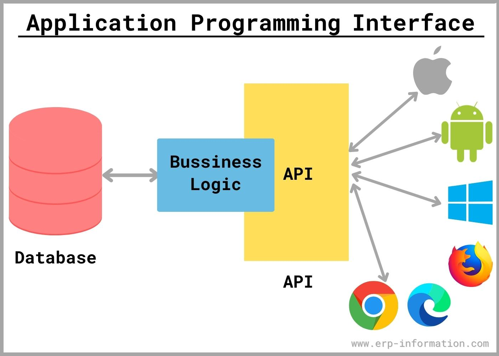

# Exercise 19: Mocks

In this lesson, we will learn what an  API's are and also how and why we mock data.

## What is an API?

“An application programming interface (API) is a set of routines, protocols, and tools for building software applications. An API expresses a software component in terms of its operations, inputs, outputs, and underlying types. An API defines functionalities that are independent of their respective implementations, which allows definitions and implementations to vary without compromising each other. A good API makes it easier to develop a program by providing all the building blocks.

APIs often come in the form of a library that includes specifications for routines, data structures, object classes, and variables. In other cases, notably SOAP and REST services, an API is simply a specification of remote calls exposed to the API consumers.

An API specification can take many forms, including an International Standard, such as POSIX, vendor documentation, such as the Microsoft Windows API, or the libraries of a programming language, e.g., the Standard Template Library in C++ or the Java APIs.

An API differs from an application binary interface (ABI) in that an API is source code-based while an ABI is a binary interface. For instance POSIX is an API, while the Linux Standard Base provides an ABI”.
*- Mule Soft*

 All this may sound a litte confusing but a simple way of thinking about an API is to compare it to a waiter in a restaurant.

 

You (the client) would sitting at the table with a menu (API catalogue) in front of you. The catalogue has all the options for you to order from. The kitchen is the (provider) who will fulfill your order.

In this equation, the missing component that connects everything is the waiter or (the API). Similar to how a waiter communicates with you and then the kitchen, that's how an API communicates with the client and the server.

- First the waiter takes your order.
- Delivers it to the kitchen.
- Once the food is ready, delivers the food (or response) back to you.
  

[https://www.youtube.com/watch?v=s7wmiS2mSXY](https://www.youtube.com/watch?v=s7wmiS2mSXY)

Lets look at an example.

1. Go to [https://rapidapi.com/hub](https://rapidapi.com/hub)
2. Search for Movie Database Alternative.
3. Click the Example Response.

Notice that the response is a JSON object with `"3"` items (properties). One of these properties is an array of objects, with 5 items.

Inside the object is where we can find the information about a particular movie.

## How does it work?

APIs allow your application or service communicate with other products and services without having to know how they’re implemented, simplifying the app development process and saving time and money.

APIs simplify the way we connect our own infrastructure through cloud-native app development, but they also allow us to share our data with customers and other external users.
Public APIs represent unique business value because they can simplify and expand how you connect with your partners, as well as potentially monetize your data (the Google Maps API is a popular example).

---
